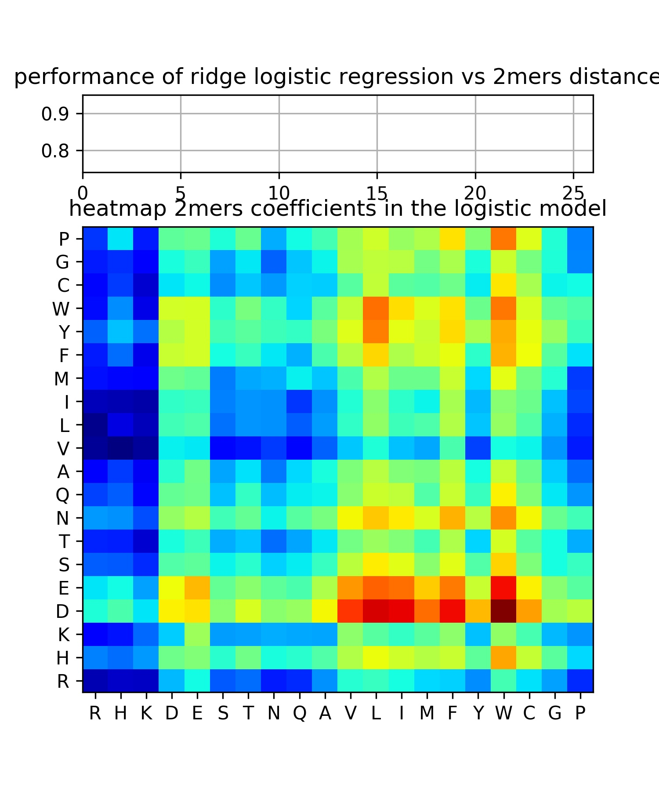

* [First notebook](https://htmlpreview.github.io/?https://github.com/aerijman/Transcriptional-Activation-Domains/blob/gh-pages/TADs_primer.html).
* [Steve,s notes](https://github.com/aerijman/Transcriptional-Activation-Domains/blob/gh-pages/9_6_18%20Nobel%20meeting.pdf) from the meeting with Jacob, Bill and me on 9/6/2018 where we discussed the results from the first notebook.

* Methods to interpret the models, [1](http://papers.nips.cc/paper/7062-a-unified-approach-to-interpreting-model-predictions.pdf) and [2](https://arxiv.org/pdf/1703.01365.pdf)

* [Johannes method](https://uniclust.mmseqs.com) to cluster UniProt towards faster blast (used in ss prediction)
* [Spectrum kernel](http://psb.stanford.edu/psb-online/proceedings/psb02/leslie.pdf) technique. To mke it work with our high dimentionality, [THIS](http://citeseerx.ist.psu.edu/viewdoc/download?doi=10.1.1.144.9009&rep=rep1&type=pdf) might be a solution (found it at [stack exchange](https://datascience.stackexchange.com/questions/989/svm-using-scikit-learn-runs-endlessly-and-never-completes-execution)).  

* [second notebook](http://htmlpreview.github.io/?https://github.com/aerijman/TADs-analysis/blob/master/TAD_second_clean.html)

* [Steve's notes](./10_2_2028_talk_with_Johannes.pdf) from meeting with Johannes on 2/10/2018 

* A [wrap-up](./UtahConference.htm) including figures presented at the asbmb meeting in Utah, 2018

* Our [predictions](./predict_sequences.html) look good on a very small set of known activators from yeast and one from drosophyla. We have to test the model in a bigger validation set before publication.

* Interestingly, in [Stark publication](http://emboj.embopress.org/content/37/16/e98896) a region at about positions 250 was found to be tAD in Drosophila. The reported gene used for their findings is developmental core promoter, which is inducible (same as the one we are using in our experiments with ARG3!!).[1](#1)
We found the same using our predictor!!

Addgene ID 71169, section Cloning of luciferase reporter vectors of [this](https://www.nature.com/articles/nature15545) publication.
